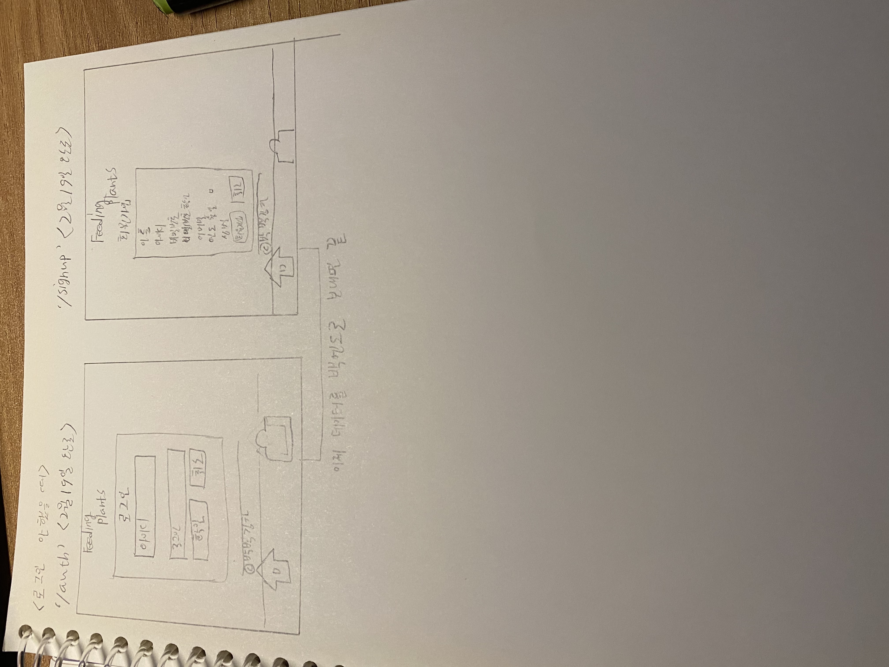

# Front-End Diary
## 1. 만들어야 하는 페이지:
- [x] 홈 (로그인X) / 난이도: 쉬움
- [ ] 프로필 (로그인X)(로그인, 회원가입 포함) / 난이도: 어려움
- [ ] 홈 / 난이도: 어려움
- [ ] 프로필 / 난이도: 보통 
- [ ] 식물추가하기 / 난이도: 어려움

## 2. 내일의 할 일
- [ ] jwt 공부하기
- [ ] redux 영상 보고, 학습하기
- [ ] adding plants 부분 페이지 밑 그림과 데이터 작업하기

## 3. 스케치

> ## 2021.02.19 '/profle'부분 LOGOUT을 SIGNUP으로 수정

> ## 2021.02.19 디자인은 끝났으나 아직 데이터를 백엔드로 보내지는 못함.

> ## 2021.02.20 데이터를 보내는 코드들은 작성했고, 백엔드와 함께 확인해야함.

> ## 2021.02.23 아직 인증에 대해서 해결을 하지 못했으나 Json Web Token 형식으로 하기로 결정함(정훈이와 함께)
> ## 그리고 오늘은 Redux 공부함. 곧 적용할 예정임.

